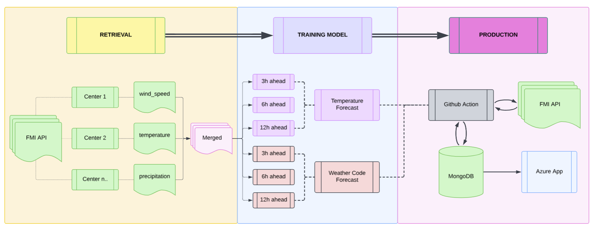

# Finland Weather Predictor

## Azure webpage: https://weather-predictor.azurewebsites.net/

A machine learning pipeline that predicts Finnish weather transitions using real-time data from the **[Finnish Meteorological Institute (FMI)](https://en.ilmatieteenlaitos.fi/)**.

## Version History

| Version | Date  | Notable Changes |
|---------|------|-----------------|
| **v3** | 2026-04-02 | Minor Bug Fix and Documentation |
| **v2** | 2026-03-06 | Weather code classification (Clear / Rain / Snow), FMI Harmonie NWP comparison, dual WFS endpoints, gap-split evaluation |
| **v1** | 2026-03-04 | Initial proof-of-concept, temperature-only forecasting, single WFS endpoint |

## Deployment Pipeline

- **GitHub Actions:** Triggers every hour — fetches FMI observations, engineers features, runs inference, upserts results to MongoDB. 

- **Docker:** Packages the Flask app into a consistent environment for local-to-cloud parity.
- **Azure App Service:** Hosts the dashboard, pulling the latest image from Docker Hub.
- **MongoDB Atlas:** Stores one document per city per hour containing current conditions, model predictions, and FMI Harmonie NWP forecasts.

## Models

### Temperature — XGBoost Regression

Predicts air temperature at +6h, +12h, and +24h horizons.

| Horizon | MAE | RMSE | R² |
|---------|-----|------|----|
| +6h | 0.99°C | 1.40°C | 0.98 |
| +12h | 1.59°C | 2.19°C | 0.95 |
| +24h | 2.41°C | 3.32°C | 0.89 |

*Evaluated on held-out winter test set: Nov 2025 → Mar 2026*

### Weather Code — LightGBM Classifier

Predicts weather class (0 = Clear, 1 = Rain, 2 = Snow) at +3h, +6h, and +12h horizons.

**+3h Classification Report** (macro F1: 0.58)

| Class | Precision | Recall | F1 |
|-------|-----------|--------|----|
| Clear | 0.85 | 0.62 | 0.72 |
| Rain | 0.37 | 0.55 | 0.44 |
| Snow | 0.50 | 0.73 | 0.59 |

**+6h Classification Report** (macro F1: 0.51)

| Class | Precision | Recall | F1 |
|-------|-----------|--------|----|
| Clear | 0.81 | 0.51 | 0.62 |
| Rain | 0.30 | 0.44 | 0.35 |
| Snow | 0.44 | 0.73 | 0.55 |

**+12h Classification Report** (macro F1: 0.42)

| Class | Precision | Recall | F1 |
|-------|-----------|--------|----|
| Clear | 0.76 | 0.36 | 0.49 |
| Rain | 0.20 | 0.37 | 0.26 |
| Snow | 0.40 | 0.77 | 0.52 |

*Train/val/test uses a seasonal gap split — both val and test sets cover full Finnish winters from separate years to ensure reliable snow and rain evaluation.*

## Cities Covered

| City | Stations | Type |
|------|----------|------|
| Helsinki | Kumpula | Coastal |
| Oulu | Airport, Kaukovainio | Coastal |
| Tampere | Airport, Harmala | Inland |
| Turku | Artukainen | Coastal |
| Rovaniemi | Apukka, Airport | Arctic inland |
| Vaasa | Klemettila, Airport | Coastal |

---

## Notebooks

- [`temp_forecast.ipynb`](v2_Notebook/temp_forecast.ipynb) — Temperature model training and evaluation
- [`code_forecast.ipynb`](v2_Notebook/code_forecast.ipynb) — Weather code classifier training and evaluation